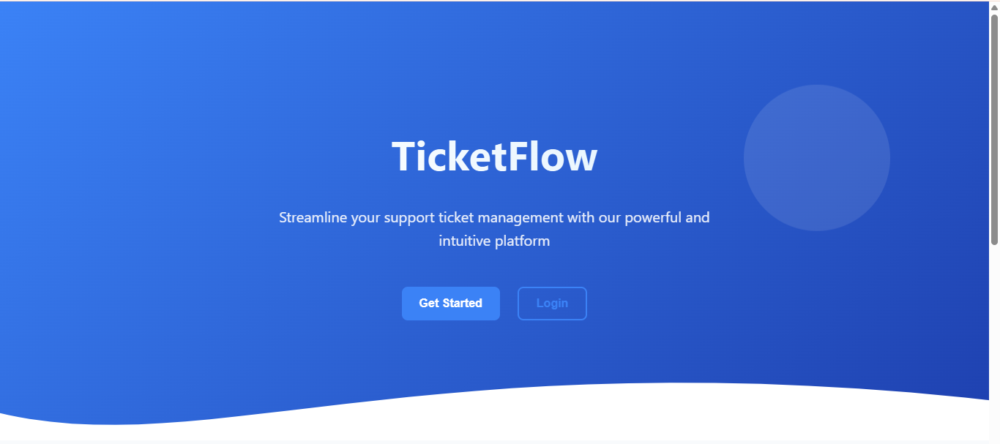
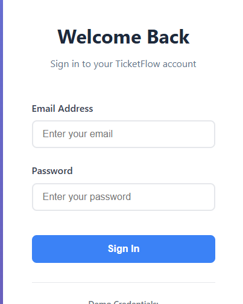
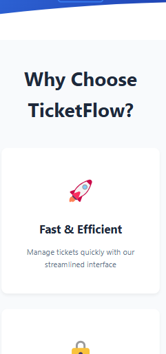

# Ticket Management System - React Implementation

<div align="center">





A modern, full-featured ticket management web application built with React, featuring secure authentication, CRUD operations, and a beautiful responsive design.

</div>

---

## 📋 Table of Contents

- [Overview](#overview)
- [Features](#features)
- [Tech Stack](#tech-stack)
- [Project Structure](#project-structure)
- [Getting Started](#getting-started)
- [Authentication](#authentication)
- [Design System](#design-system)
- [Accessibility](#accessibility)
- [Known Issues](#known-issues)
- [Contributing](#contributing)

---

## 🎯 Overview

This is the **React implementation** of a multi-framework ticket management system. The application provides a complete solution for managing support tickets with a focus on user experience, security, and design consistency.

### Key Highlights

- ✅ **Full CRUD Operations** - Create, Read, Update, Delete tickets
- 🔐 **Secure Authentication** - Session-based auth with protected routes
- 🎨 **Modern Design** - Wavy hero sections, decorative circles, and card-based layouts
- 📱 **Fully Responsive** - Mobile-first design that adapts to all screen sizes
- ♿ **Accessible** - WCAG compliant with semantic HTML and ARIA labels
- ⚡ **Real-time Validation** - Instant feedback on form inputs
- 🎭 **Toast Notifications** - Beautiful success/error messages

---

## ✨ Features

### 1. Landing Page

- Eye-catching hero section with SVG wavy background
- Decorative circular elements for visual appeal
- Clear call-to-action buttons (Login & Get Started)
- Feature showcase with card-style sections
- Responsive footer across all pages
- Centered layout with max-width of 1440px

### 2. Authentication System

- **Login Page** - Secure user login with validation
- **Signup Page** - New user registration
- **Form Validation** - Real-time error checking
- **Toast Notifications** - Success and error feedback
- **Session Management** - LocalStorage-based tokens
- **Protected Routes** - Automatic redirection for unauthorized access

### 3. Dashboard

- **Statistics Overview**
  - Total Tickets count
  - Open Tickets count
  - Resolved Tickets count
- Quick navigation to Ticket Management
- Prominent Logout functionality
- Welcome message with user context

### 4. Ticket Management (CRUD)

- **Create Tickets** - Form with validation for new tickets
- **View Tickets** - Card-style display with status badges
- **Edit Tickets** - Update existing ticket details
- **Delete Tickets** - Remove with confirmation modal
- **Status Management** - Visual indicators (Open, In Progress, Closed)
- **Real-time Feedback** - Toast notifications for all actions

---

## 🛠 Tech Stack

### Core Technologies

- **React** 18.x - UI library
- **React Router DOM** - Client-side routing
- **Vite** - Build tool and dev server

### State Management & Hooks

- **Custom Hooks**
  - `useAuth.js` - Authentication state and logic
  - `useTickets.js` - Ticket CRUD operations and state

### Styling

- **CSS Modules** - Scoped component styles
- **Custom CSS** - Design system implementation
- No external CSS frameworks (pure custom styling)

### Development Tools

- **ESLint** - Code linting
- **Vite Config** - Optimized build configuration

---

## 📁 Project Structure

```
ticket-app-react/
├── node_modules/
├── public/                          # Static assets
├── src/
│   ├── assets/                      # Images, SVGs, icons
│   ├── components/
│   │   ├── tickets/
│   │   │   ├── TicketCard.jsx       # Individual ticket display
│   │   │   ├── TicketCard.module.css
│   │   │   ├── TicketForm.jsx       # Create/Edit ticket form
│   │   │   └── TicketForm.module.css
│   │   └── ui/
│   │       ├── Toast.jsx            # Toast notification component
│   │       ├── Toast.module.css
│   │       └── ProtectedRoute.jsx   # Route protection wrapper
│   ├── hooks/
│   │   ├── useAuth.js               # Authentication logic
│   │   └── useTickets.js            # Ticket management logic
│   ├── pages/
│   │   ├── Auth.module.css          # Auth pages styling
│   │   ├── Dashboard.jsx            # Dashboard page
│   │   ├── Dashboard.module.css
│   │   ├── Landing.jsx              # Landing/Home page
│   │   ├── Landing.module.css
│   │   ├── Login.jsx                # Login page
│   │   ├── Tickets.jsx              # Ticket management page
│   │   └── Tickets.module.css
│   ├── utils/
│   │   ├── App.css                  # Global styles
│   │   ├── App.jsx                  # Root component with routing
│   │   ├── index.css                # CSS reset and base styles
│   │   └── main.jsx                 # Application entry point
├── .gitignore
├── eslint.config.js
├── index.html
├── package-lock.json
├── package.json
├── README.md                        # This file
└── vite.config.js
```

### Component Architecture

#### Custom Hooks

- **`useAuth.js`** - Manages authentication state, login/signup/logout operations
- **`useTickets.js`** - Handles ticket CRUD operations, form state, and validation

#### UI Components

- **`ProtectedRoute.jsx`** - HOC for route protection
- **`Toast.jsx`** - Reusable notification component
- **`TicketCard.jsx`** - Individual ticket display with status badges
- **`TicketForm.jsx`** - Unified form for creating/editing tickets

#### Pages

- **`Landing.jsx`** - Homepage with hero and features
- **`Login.jsx`** - Authentication page (login/signup tabs)
- **`Dashboard.jsx`** - Statistics and quick navigation
- **`Tickets.jsx`** - Full ticket management interface

---

## 🚀 Getting Started

### Prerequisites

- **Node.js** 16.x or higher
- **npm** 8.x or higher (or yarn/pnpm)

### Installation

1. **Clone the repository**

   ```bash
   git clone <repository-url>
   cd ticket-app-react
   ```

2. **Install dependencies**

   ```bash
   npm install
   ```

3. **Start the development server**

   ```bash
   npm run dev
   ```

4. **Open your browser**
   ```
   Navigate to: http://localhost:5173
   ```

### Build for Production

```bash
npm run build
```

The optimized build will be in the `dist/` folder.

### Preview Production Build

```bash
npm run preview
```

---

## 🔐 Authentication

### How It Works

The application uses **localStorage-based authentication** to simulate a real authentication system.

#### Session Management

- **Session Key**: `ticketapp_session`
- **Storage**: Browser localStorage
- **Token Format**: JSON object with user details

#### Test Credentials

For **Login**:

```
Email: demo@example.com
Password: password123
```

Or **Sign Up** with any email/password combination.

#### Protected Routes

The following routes require authentication:

- `/dashboard` - Dashboard page
- `/tickets` - Ticket management page

**Unauthorized access** automatically redirects to `/auth/login`.

#### Logout Process

1. Click the "Logout" button in the navigation
2. Session token is cleared from localStorage
3. User is redirected to the landing page

---

## 🎨 Design System

### Layout Specifications

- **Max Width**: 1440px (centered on large screens)
- **Responsive Breakpoints**:
  - Mobile: < 768px
  - Tablet: 768px - 1024px
  - Desktop: > 1024px

### Visual Elements

#### Hero Section

- **Wavy Background**: SVG path with smooth curves
- **Decorative Circles**: Positioned absolutely with gradient fills
- **Call-to-Action**: Prominent buttons with hover effects

#### Card Components

- **Box Shadow**: `0 2px 8px rgba(0,0,0,0.1)`
- **Border Radius**: 12px
- **Padding**: 24px
- **Hover Effect**: Slight elevation increase

### Color Palette

#### Status Colors

| Status      | Color | Hex Code  | Usage            |
| ----------- | ----- | --------- | ---------------- |
| Open        | Green | `#10b981` | New tickets      |
| In Progress | Amber | `#f59e0b` | Active tickets   |
| Closed      | Gray  | `#6b7280` | Resolved tickets |

#### Primary Colors

- **Primary**: `#3b82f6` (Blue)
- **Success**: `#10b981` (Green)
- **Error**: `#ef4444` (Red)
- **Warning**: `#f59e0b` (Amber)

### Typography

- **Font Family**: System fonts stack
- **Headings**: 700 weight
- **Body**: 400 weight
- **Line Height**: 1.6

---

## 🎭 Components Deep Dive

### TicketCard Component

Displays individual ticket information in a card format.

**Props**:

- `ticket` (object) - Ticket data
- `onEdit` (function) - Edit callback
- `onDelete` (function) - Delete callback

**Features**:

- Status badge with color coding
- Priority indicator
- Action buttons (Edit/Delete)
- Hover effects

### TicketForm Component

Unified form for creating and editing tickets.

**Props**:

- `onSubmit` (function) - Form submission handler
- `initialData` (object) - Pre-filled data for editing
- `isEdit` (boolean) - Edit mode flag

**Validation Rules**:

- **Title**: Required, min 3 characters
- **Status**: Required, must be "open", "in_progress", or "closed"
- **Description**: Optional, max 500 characters
- **Priority**: Optional, must be "low", "medium", or "high"

### Toast Component

Notification system for user feedback.

**Types**:

- `success` - Green background
- `error` - Red background
- `info` - Blue background
- `warning` - Amber background

**Auto-dismiss**: 3 seconds (configurable)

### ProtectedRoute Component

Higher-order component for route protection.

**Behavior**:

- Checks for valid session token
- Redirects to login if unauthorized
- Preserves attempted route for post-login redirect

---

## ♿ Accessibility

### Compliance

- **WCAG 2.1 Level AA** compliant
- **Semantic HTML5** elements throughout
- **ARIA labels** on interactive elements
- **Keyboard navigation** fully supported

### Features

- **Focus Indicators**: Visible on all interactive elements
- **Alt Text**: All images have descriptive alt attributes
- **Color Contrast**: Minimum 4.5:1 ratio for text
- **Screen Reader**: Proper heading hierarchy and landmarks
- **Form Labels**: All inputs properly labeled

### Keyboard Shortcuts

- `Tab` - Navigate forward
- `Shift + Tab` - Navigate backward
- `Enter` - Submit forms / Activate buttons
- `Esc` - Close modals

---

## 📊 Data Validation

### Form Validation Rules

#### Ticket Creation/Update

```javascript
{
  title: {
    required: true,
    minLength: 3,
    maxLength: 100,
    message: "Title must be between 3-100 characters"
  },
  status: {
    required: true,
    enum: ["open", "in_progress", "closed"],
    message: "Status must be open, in_progress, or closed"
  },
  description: {
    required: false,
    maxLength: 500,
    message: "Description cannot exceed 500 characters"
  },
  priority: {
    required: false,
    enum: ["low", "medium", "high"],
    message: "Priority must be low, medium, or high"
  }
}
```

#### Authentication

- **Email**: Valid email format required
- **Password**: Minimum 6 characters

### Error Messages

Error messages are user-friendly and specific:

- ❌ "Title is required"
- ❌ "Invalid status value. Must be: open, in_progress, or closed"
- ❌ "Your session has expired - please log in again"
- ❌ "Failed to load tickets. Please retry"

---

## ⚠️ Known Issues & Limitations

### Current Limitations

1. **Mock Authentication** - Uses localStorage instead of real backend
2. **No Data Persistence** - Data stored in memory/localStorage only
3. **Single User** - No multi-user support
4. **No Image Upload** - Ticket attachments not supported
5. **Limited Search** - No advanced filtering or search functionality

### Browser Compatibility

- ✅ Chrome 90+
- ✅ Firefox 88+
- ✅ Safari 14+
- ✅ Edge 90+

### Future Enhancements

- [ ] Real backend API integration
- [ ] Advanced search and filtering
- [ ] Ticket assignment to users
- [ ] Email notifications
- [ ] File attachments
- [ ] Ticket comments/history
- [ ] Dark mode support
- [ ] Export tickets to CSV/PDF

---

## 🐛 Troubleshooting

### Common Issues

**Issue**: Port 5173 already in use

```bash
# Solution: Use a different port
npm run dev -- --port 3000
```

**Issue**: Module not found errors

```bash
# Solution: Reinstall dependencies
rm -rf node_modules package-lock.json
npm install
```

**Issue**: Can't access protected routes

```bash
# Solution: Clear localStorage and login again
# Open browser console and run:
localStorage.clear()
```

---

## 📱 Responsive Design

### Mobile (< 768px)

- Single column layout
- Stacked navigation menu (hamburger)
- Full-width cards
- Touch-optimized buttons

### Tablet (768px - 1024px)

- Two-column grid for tickets
- Expanded navigation
- Optimized spacing

### Desktop (> 1024px)

- Three-column grid for tickets
- Full navigation bar
- Maximum width constraint (1440px)
- Hover effects enabled

---

## 🔒 Security Considerations

### Current Implementation

- Session tokens stored in localStorage
- Basic input sanitization
- Protected routes with redirect
- Form validation on client-side

### Production Recommendations

- Implement JWT authentication
- Add CSRF protection
- Use HTTPS only
- Add rate limiting
- Implement server-side validation
- Use secure HTTP-only cookies

---

## 🧪 Testing

### Manual Testing Checklist

- [ ] Landing page loads correctly
- [ ] Login with valid credentials works
- [ ] Login with invalid credentials shows error
- [ ] Signup creates new account
- [ ] Dashboard shows correct statistics
- [ ] Create ticket form validates inputs
- [ ] Created ticket appears in list
- [ ] Edit ticket updates correctly
- [ ] Delete ticket removes from list
- [ ] Logout clears session
- [ ] Protected routes redirect when not authenticated
- [ ] Responsive design works on mobile/tablet/desktop

---

## 📄 License

This project is part of a technical assessment and is for demonstration purposes only.

---

## 👥 Contributing

This is a showcase project for a technical assessment. For the Vue.js and Twig implementations, please refer to their respective repositories:

- **Vue.js Implementation**: [https://github.com/Anonymous2024-spec/ticket-app-vue]
- **Twig Implementation**: [https://github.com/Anonymous2024-spec/ticket-app-twig]

---

## 📞 Support

For questions or issues with this implementation, please:

1. Check the [Known Issues](#known-issues) section
2. Review the [Troubleshooting](#troubleshooting) guide
3. Contact the development team

---

<div align="center">

**Built with ❤️ using React**

[Back to Top](#ticket-management-system---react-implementation)

</div>
